# Project_Restaurant_VueJS

Projekt zawiera aplikację serwerową oraz aplikację Web kliencką. Domena opiera się na prostym modelu zamawianiu produktów. System ma możliwość wysłania zamówienia na maila. Technologie użyte:

- Net 6
- NHibernate
- FluentMigrator
- SQLite
- Vue 3
- Bootstrap 5

# Aplikacja serwerwa

Napisana w Net 6 zawiera prostą domenę. ORM Nhibernate. Tworzenie schematu bazy danych przy użyciu FluentMigrator. Dodatkowo projekt posiada testy jednostkowe i integracyjne

# Aplikacja kliencka

Napisana w Vue 3, zawiera prosty mechanizm logowania do systemu.

# Screen

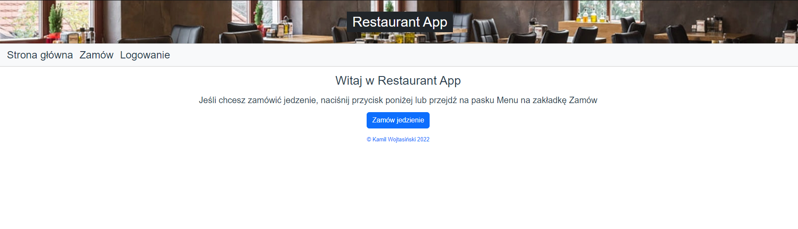

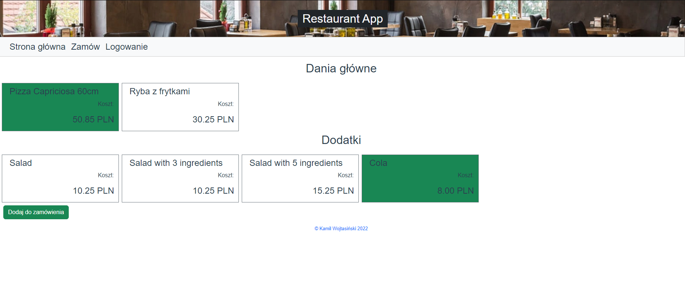

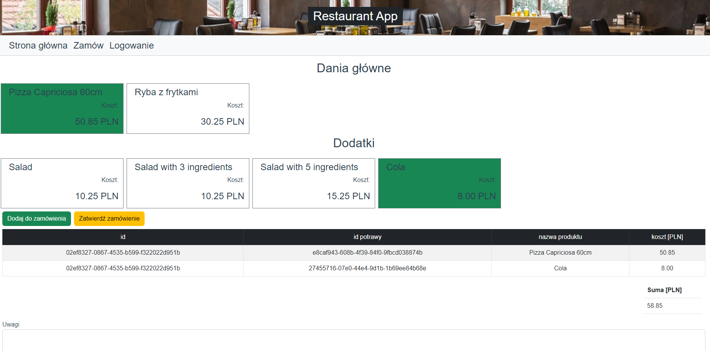

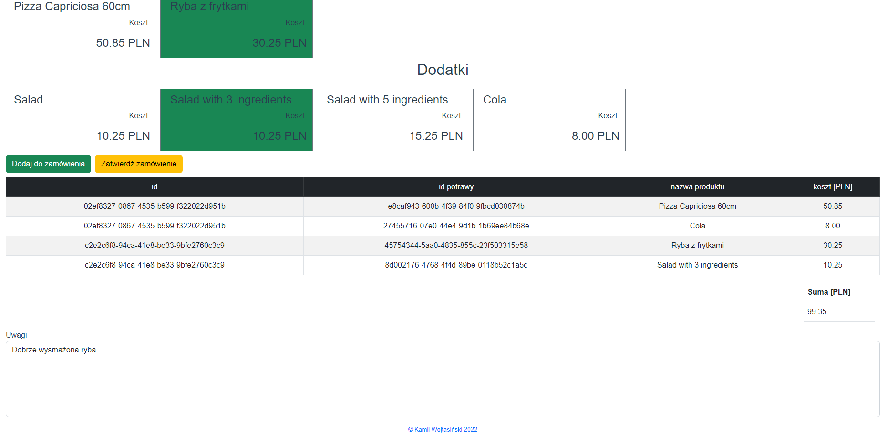

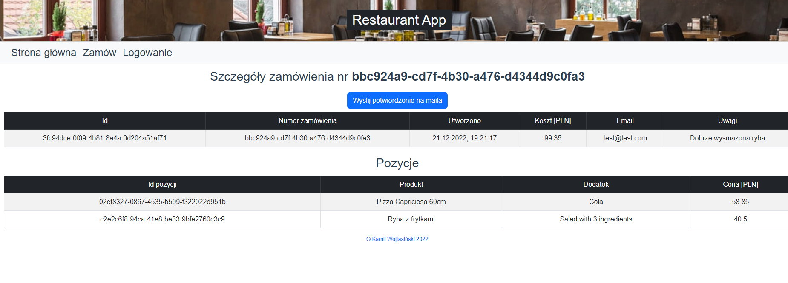

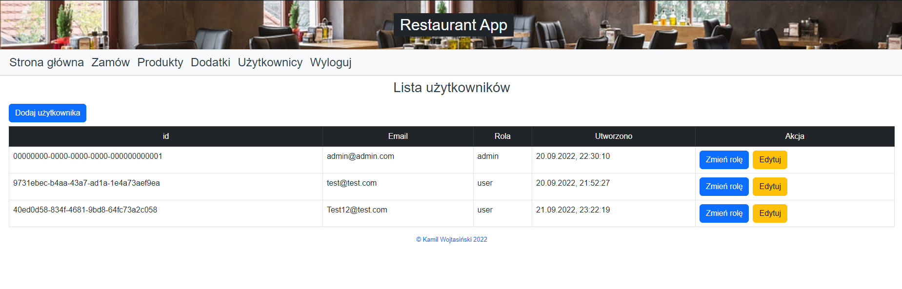

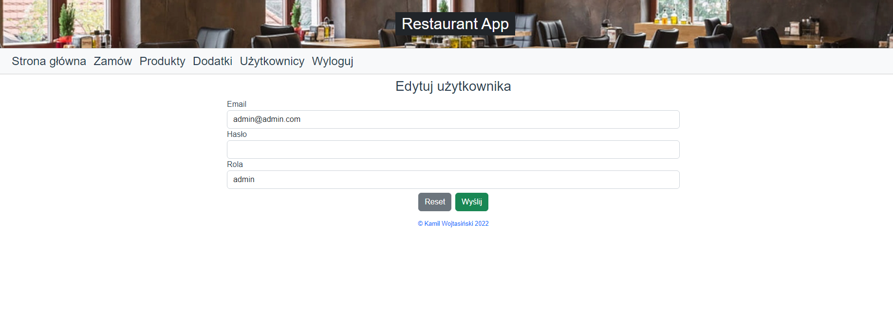

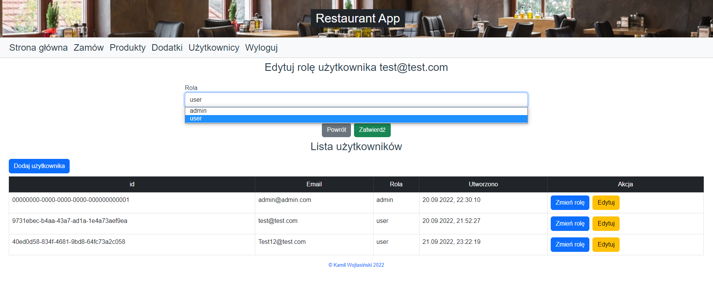

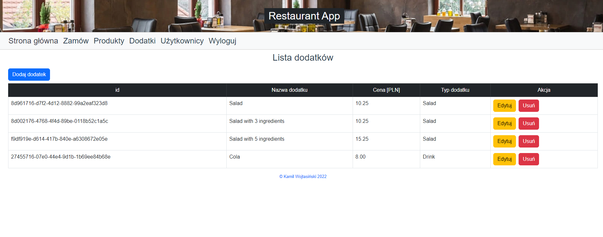

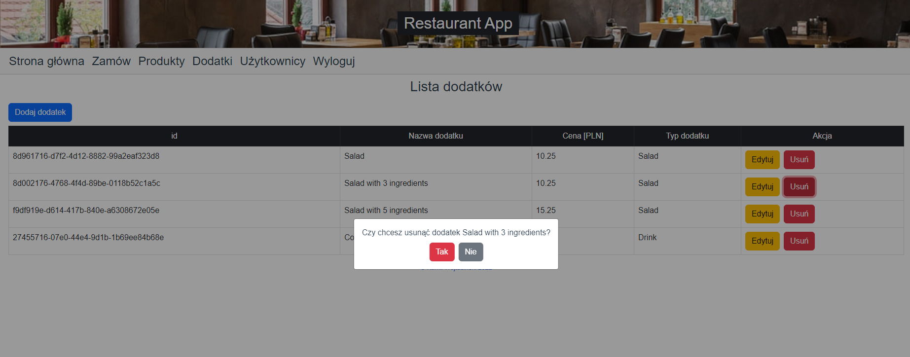

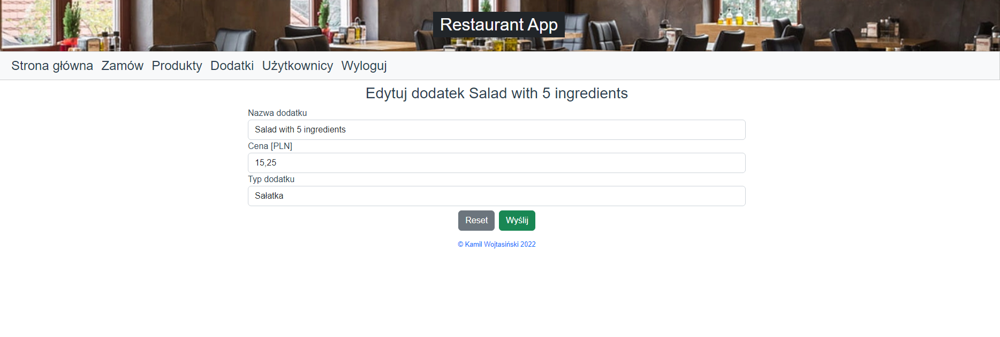

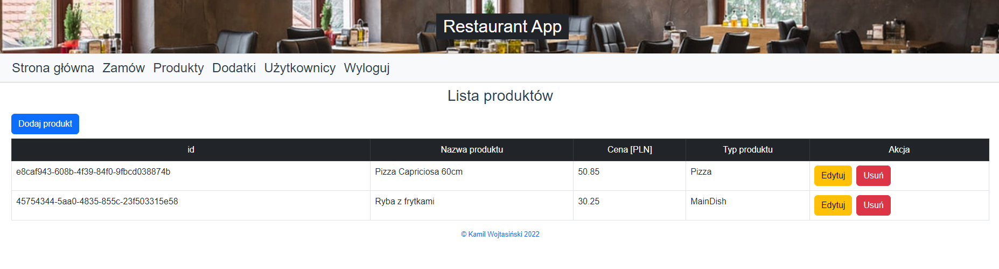

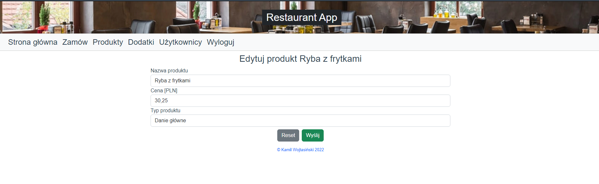